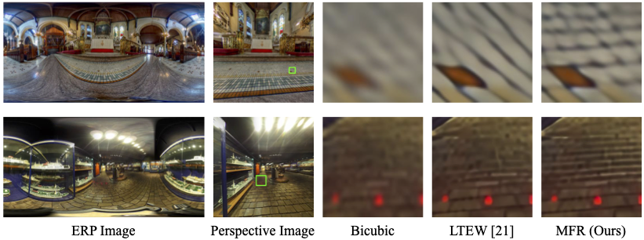

## Towards Progressive Multi-Frequency Representation for Image Warping (CVPR 2024)

[Jun Xiao](https://junxiao01.github.io/), [Zihang Lyu](https://scholar.google.com/citations?hl=zh-CN&user=fiUfefMAAAAJ), [Cong Zhang](https://scholar.google.com/citations?user=hHUH1VAAAAAJ&hl=en/), [Yakun Ju](https://kelvin-ju.github.io/yakunju/), [Changjian Shui](https://cjshui.github.io/), [Kin-Man Lam](https://scholar.google.com/citations?user=6yK7bewAAAAJ&hl=zh-CN)

The Hong Kong Polytechnic University, Nanyang Technological University, Vector Institute

---

**Abstract:** Image warping, a classic task in computer vision, aims to use geometric transformations to change the appearance of images. Recent methods learn the resampling kernels for warping through neural networks to estimate missing values in irregular grids, which, however, fail to capture local variations in deformed content and produce images with distortion and less high-frequency details. To address this issue, this paper proposes an effective method, namely MFR, to learn Multi-Frequency Representations from input images for image warping. Specifically, we propose a progressive filtering network to learn image representations from different frequency subbands and generate deformable images in a coarse-to-fine manner. Furthermore, we employ learnable Gabor wavelet filters to improve the model's capability to learn local spatial-frequency representations. Comprehensive experiments, including homography transformation, equirectangular to perspective projection, and asymmetric image super-resolution, demonstrate that the proposed MFR significantly outperforms state-of-the-art image warping methods. Our method also showcases superior generalization to out-of-distribution domains, where the generated images are equipped with rich details and less distortion, thereby high visual quality.


## 🔗 Contents

- [x] [Installation](#Installation)
- [x] [Prepare Datasets](#Prepare-Datasets)
- [x] [Pre-trained Models](#Pre-trained-Models)
- [x] [Train and Test](#Train-and-Test)
- [x] [Visual Results](#Visual-Results)
- [x] [Citation](#Citation)


## Installation

> - Python 3.8, PyTorch >= 1.10.0
> - Requirements: see requirements.txt
> - Platforms: Ubuntu 20.04, cuda-11.3

We recommend using [conda](https://www.anaconda.com/distribution/) for installation:

```
conda env create --file environment.yaml
conda activate mfn
```

Our codes rely on the project of [SRWarp](https://github.com/sanghyun-son/srwarp). Please install it using the following commands.

```
git clone https://github.com/sanghyun-son/pysrwarp
cd pysrwarp
make
```

If your CUDA compatibility is sm86, modify cuda/Makefile before make.

```
vi cuda/Makefile
```

## Prepare datasets.

**Homography transformation**

- **DIV2K**: [DIV2KW (isc)](https://drive.google.com/drive/folders/1v0zHDzTqghUS3awrw9aQtpSyREBPR-cz?usp=sharing), [DIV2KW (osc)](https://drive.google.com/drive/folders/1sPR3tSnIEfnfWOsbPxWuaFQsCr5kiLT7?usp=sharing)

- **Benchmark datasets**: [Set5W (isc)](https://drive.google.com/drive/folders/19p46Fm1GqxFaz9N6lb5-xEF6fZ4dcVmy?usp=sharing), [Set5W (osc)](https://drive.google.com/drive/folders/1a2BebB8xPnkRc7nKzWkEVao2XK76qJst?usp=sharing), [Set14W (isc)](https://drive.google.com/drive/folders/14QrEoZ1GdQ63lLIHQ1fIsljcVzLYJxTF?usp=share_link), [Set14W (osc)](https://drive.google.com/drive/folders/1qCBzQaLaCCAsj99kDoNWKl_tlj6c6tj_?usp=sharing), [B100W (isc)](https://drive.google.com/drive/folders/1-gr0zMLSkiM_5avZ9C2LVlGeKvNySzlM?usp=sharing), [B100W (osc)](https://drive.google.com/drive/folders/1cvzXRQLw9qJoQoF7LxlT5SRIWdcnH5O5?usp=sharing), [Urban100W (isc)](https://drive.google.com/drive/folders/1sW3T-BislLrXFzqVaFLvLqw0a96Psjt_?usp=sharing), [Urban100W (osc)](https://drive.google.com/drive/folders/135FEZ96sc0I1QcyBKwaHAaiMvIbPZ4yR?usp=sharing)

**Symmetric-scale SR**

1.1 Download [benchmark datasets](https://github.com/xinntao/BasicSR/blob/a19aac61b277f64be050cef7fe578a121d944a0e/docs/Datasets.md) (e.g., Set5, Set14 and other test sets).
1.2 `mkdir datasets`, create a folder named 'datasets'
1.3 Cd to `./scripts` and run `generate_bicubic_asym_img.m` in Matlab to prepare HR/LR images in `your_data_path` as belows:

The structure of the datasets are as follows:

```
datasets
├── benchmark
│   ├── B100
│   │   ├── HR
│   │   ├── LR_bicubic
│   │   ├── LR_bicubic_Transform
│   │   ├── LR_warp_in_scale
│   │   └── LR_warp_out_of_scale
│   ├── Set14
│   │   ├── HR
│   │   ├── LR_bicubic
│   │   ├── LR_warp_in_scale
│   │   └── LR_warp_out_of_scale
│   ├── Set5
│   │   ├── HR
│   │   ├── LR_bicubic
│   │   ├── LR_warp_in_scale
│   │   └── LR_warp_out_of_scale
│   └── Urban100
│       ├── HR
│       ├── LR_bicubic
│       ├── LR_warp_in_scale
│       └── LR_warp_out_of_scale
├── div2k
│   ├── DIV2K_train_HR
│   ├── DIV2K_train_LR_bicubic
│   ├── DIV2K_valid_HR
│   ├── DIV2K_valid_LR_bicubic
│   ├── DIV2K_valid_LR_warp_in_scale
│   └── DIV2K_valid_LR_warp_ouf_of_scale
```

## Pre-trained Models

Model|Download
:-:|:-:
MFN-EDSR-baseline|[Google Drive]()
MFN-RRDB|[Google Drive]()
MFN-RCAN|[Google Drive]()

## Train and Test

### **Homography transformation**

**Train**: `CUDA_VISIBLE_DEVICES=0,1 python train_warp.py --config configs/train/train_rrdb_resmfn_warp.yaml --gpu 0,1`

**Test**: `bash ./scripts/test_scripts/test-benchmark-warp.sh {YOUR_MODEL_PATH} 0`

###  **Asymmetric-scale SR**

**Train**: `CUDA_VISIBLE_DEVICES=0 python train_sr.py --config configs/train/train_rcan_resmfn.yaml --gpu 0`

**Test**: `bash ./scripts/test-benchmark-asym.sh {YOUR_MODEL_PATH} 0`


## Visual Results

### Homograph Transform (In-scale)


### Homograph Transform (Out-of-scale)


### Asymmetric-scale SR (In-scale)


### Asymmetric-scale SR (Out-of-scale)


### Equirectangular to Perspective Projection



## Citation

If you find our work useful in your research, please consider citing our paper:

```
@inproceedings{xiao2024towards,
  title={Towards Progressive Multi-Frequency Representation for Image Warping},
  author={Xiao, Jun and Lyu, Zihang and Zhang, Cong and Ju, Yakun and Shui, Changjian and Lam, Kin-Man},
  booktitle={Proceedings of the IEEE/CVF Conference on Computer Vision and Pattern Recognition},
  pages={2995--3004},
  year={2024}
}
```

## Acknowledgements

This code is built on [LETW](https://github.com/jaewon-lee-b/ltew) and [SRWarp](https://github.com/sanghyun-son/srwarp). We thank the authors for sharing their codes.
